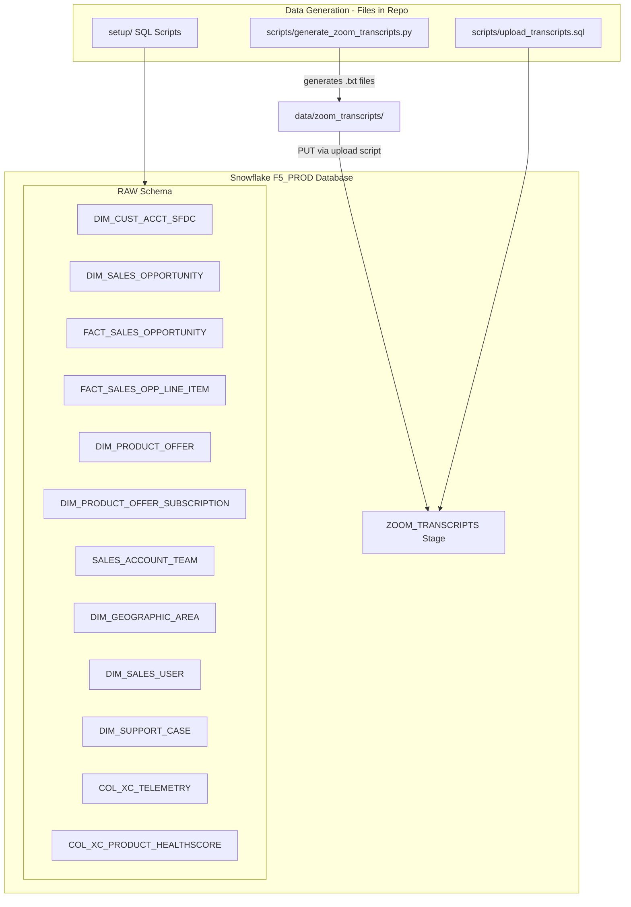

# Plan: F5 Hands-On Lab Build (Prompt.md Only)

## Context

This repository (`F5_HOL`) is a hands-on lab scaffold for ~40 F5 data engineers. The scope for this phase covers only the requirements in [coco_prompts/Prompt.md](coco_prompts/Prompt.md):

1. Create F5_PROD database with synthetic Fortune 500 customer data (including failed expansion opportunities)
2. Create a sales account team table with territory mapping
3. Generate Zoom call transcript files for 25% of accounts
4. Create an upload script for the transcripts

**Key references:**
- [Source_Data/DDLs/F5_DDLs.txt](Source_Data/DDLs/F5_DDLs.txt) — Real F5 schema (17 tables) to guide field selection
- [Source_Data/Old_Scripts/generate_transcripts.py](Source_Data/Old_Scripts/generate_transcripts.py) — 155 Fortune 500 accounts + transcript generation logic
- [Source_Data/Zoom_transcript_example.txt](Source_Data/Zoom_transcript_example.txt) — WEBVTT format target
- [Source_Data/Old_Scripts/legacy_insert_gong_transcripts.sql](Source_Data/Old_Scripts/legacy_insert_gong_transcripts.sql) — SQL-based transcript generation pattern

**From the Zoom planning call, key product context:**
- F5 products: BIG-IP (load balancers/ADC), NGINX (web server/reverse proxy), Distributed Cloud/XC (SaaS security platform), Calypso (AI prompt security)
- Over half of internet traffic goes through F5 load balancers
- Telemetry is metered (e.g., load balancer hours divided by 720 for monthly billing)
- Sales org has territories, districts, regions, theaters

## Architecture



## Implementation Steps

### Step 1: Database and Table DDL

**Files:** `setup/01_database_setup.sql`, `setup/02_create_tables.sql`

- CREATE DATABASE F5_PROD / CREATE SCHEMA RAW (using SYSADMIN role as specified)
- Create a focused subset of the tables from F5_DDLs.txt — not every field, but enough for a complete picture:
  - `DIM_CUST_ACCT_SFDC` — ~30 key columns (account name, industry, region, revenue, employees, health indicators, territory codes)
  - `DIM_PRODUCT_OFFER` — F5 product catalog
  - `DIM_PRODUCT_OFFER_SUBSCRIPTION` — Customer subscriptions
  - `DIM_SALES_OPPORTUNITY` — Opportunity metadata
  - `FACT_SALES_OPPORTUNITY` — Opportunity dollar amounts
  - `FACT_SALES_OPPORTUNITY_LINE_ITEM` — Line-level product/pricing
  - `DIM_GEOGRAPHIC_AREA` — Territory hierarchy
  - `DIM_SALES_USER` — Sales reps
  - `DIM_SUPPORT_CASE` — Support case details
  - `COL_XC_TELEMETRY` — Usage telemetry (simplified)
  - `COL_XC_PRODUCT_HEALTHSCORE` — Product health scores
  - `SALES_ACCOUNT_TEAM` — New table for Step 2

### Step 2: Synthetic Account Data (A few hundred accounts, USA-based)

**File:** `setup/03_insert_accounts.sql`

- Use the 155 Fortune 500 companies from `generate_transcripts.py` + ~45 additional to reach ~200
- All USA-based, distributed across major timezone regions:
  - Pacific (~25%): CA, WA, OR
  - Mountain (~15%): CO, AZ, ID, MT, UT
  - Central (~30%): TX, IL, MN, MO, OH, WI, MI, IN, TN, NE
  - Eastern (~30%): NY, NJ, CT, VA, PA, MA, MD, GA, FL, NC, RI
- Each account gets: industry, employee count, annual revenue, health score, territory assignment
- Health score distribution: ~20% Excellent, ~20% Healthy, ~25% Good, ~20% At Risk, ~15% Critical

### Step 3: Product Catalog and Opportunities

**Files:** `setup/04_insert_products.sql`, `setup/05_insert_opportunities.sql`

**Products** — Real F5 product families with synthetic SKUs:
- BIG-IP (hardware ADC, virtual editions, software modules)
- NGINX (Plus, One, App Protect)
- Distributed Cloud (App Connect, WAF, Bot Defense, API Security, CDN)
- Calypso AI (AI Gateway, Prompt Security)
- Support/Services SKUs

**Opportunities** — Mix across the account base:
- ~40% Closed-Won (historical revenue)
- ~20% Open pipeline (various stages)
- ~25% Closed-Lost (including specifically **failed expansion proposals** where XC, NGINX, or Calypso were proposed with a contract and declined — important for account health/expansion analysis)
- ~15% Renewals (upcoming)

### Step 4: Sales Account Team Table

**File:** `setup/06_insert_sales_teams.sql`

- ~10 account teams, each covering ~20 accounts
- Each team: 1 Account Executive, 1 Solutions Engineer, 1 SDR
- Teams mapped to regional territories matching timezone distribution:
  - West Region (2-3 teams): Pacific timezone accounts
  - Mountain Region (1-2 teams): Mountain timezone accounts  
  - Central Region (2-3 teams): Central timezone accounts
  - East Region (2-3 teams): Eastern timezone accounts
- Fictional but realistic names and email addresses

### Step 5: Generate Zoom Call Transcript Files

**File:** `scripts/generate_zoom_transcripts.py`
**Output:** `data/zoom_transcripts/` directory

- Generate transcripts for 25% of accounts (~50 accounts)
- WEBVTT format matching [Source_Data/Zoom_transcript_example.txt](Source_Data/Zoom_transcript_example.txt):
  ```
  WEBVTT

  00:00:33.000 --> 00:00:35.000
  Speaker Name: dialogue text
  ```
- File naming: `{Customer_Name}_{YYYY-MM-DD}.txt`
- Participants: F5 AE/SE from their assigned team + customer contacts (VP IT, CISO, Director of Security, etc.)
- Content includes business insights per the prompt:
  - Fiscal planning discussions (budget cycles, approval timelines)
  - Layoff/restructuring mentions
  - Technology stack changes (cloud migrations, vendor evaluations)
  - Product feedback (positive and negative experiences with F5)
  - Competitive mentions (Cloudflare, Akamai, Imperva, AWS ALB)
- Sentiment correlated to health score (same logic as existing script)

### Step 6: Upload Script for Transcripts

**File:** `scripts/upload_transcripts.sql`

```sql
-- Create internal stage
CREATE OR REPLACE STAGE F5_PROD.RAW.ZOOM_TRANSCRIPTS_STAGE;

-- PUT files (run from SnowSQL or worksheet with local file access)
PUT file:///path/to/data/zoom_transcripts/*.txt @F5_PROD.RAW.ZOOM_TRANSCRIPTS_STAGE;

-- Verify upload
LIST @F5_PROD.RAW.ZOOM_TRANSCRIPTS_STAGE;
```

Also include a Python alternative using snowflake-connector-python for programmatic upload.

## Output File Structure

```
F5_HOL/
  setup/
    01_database_setup.sql
    02_create_tables.sql
    03_insert_accounts.sql
    04_insert_products.sql
    05_insert_opportunities.sql
    06_insert_sales_teams.sql
  scripts/
    generate_zoom_transcripts.py
    upload_transcripts.sql
  data/
    zoom_transcripts/           (generated .txt files go here)
  Source_Data/                   (existing reference material — unchanged)
  coco_prompts/                 (existing prompts — unchanged)
```

## Verification

1. Run `setup/01` through `setup/06` sequentially — all should succeed without error
2. `SELECT COUNT(*) FROM F5_PROD.RAW.DIM_CUST_ACCT_SFDC` returns ~200
3. `SELECT BILLING_STATE_PROVINCE_NAME, COUNT(*) ... GROUP BY 1` confirms timezone spread
4. `SELECT OPPORTUNITY_STAGE_NAME, COUNT(*) ... GROUP BY 1` shows mix of Won/Lost/Open
5. Query for failed expansions: `WHERE OPPORTUNITY_WON_IND = FALSE AND ...` returns ~30 rows with expansion context
6. `SELECT COUNT(DISTINCT SFDCF5_ACCT_ID) FROM SALES_ACCOUNT_TEAM` = ~200 (all accounts covered)
7. Run `python scripts/generate_zoom_transcripts.py` — produces ~50 .txt files in `data/zoom_transcripts/`
8. Spot-check a transcript file — confirms WEBVTT format with proper speaker names and business content

## Critical Files

- [Source_Data/DDLs/F5_DDLs.txt](Source_Data/DDLs/F5_DDLs.txt) — Schema reference for table structures
- [Source_Data/Old_Scripts/generate_transcripts.py](Source_Data/Old_Scripts/generate_transcripts.py) — Account list and sentiment-based transcript logic to reuse
- [Source_Data/Zoom_transcript_example.txt](Source_Data/Zoom_transcript_example.txt) — Target WEBVTT format
- [coco_prompts/Prompt.md](coco_prompts/Prompt.md) — Requirements document for this phase
