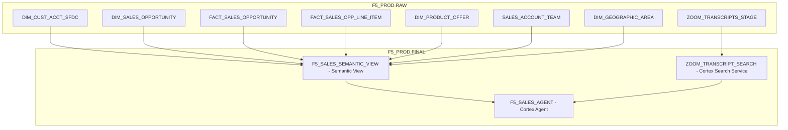

# Plan: F5 Sales Semantics, Search, and Agent

## Context

From [coco_prompts/Prompt_Sales_Semantics.md](coco_prompts/Prompt_Sales_Semantics.md), the requirements are:

1. Create a `FINAL` schema for semantic models
2. Create a Cortex Search service for zoom transcripts
3. Generate sample sales questions
4. Create a sales semantic view (accounts, opportunities, territories, products, teams) -- sales/contract/opportunity data ONLY, no telemetry or support
5. Create a Cortex Agent with the semantic view + search service + web search capability

**Data available** (from prior build session in F5_PROD.RAW):
- DIM_CUST_ACCT_SFDC (184 accounts)
- DIM_SALES_OPPORTUNITY (641 opps with failed expansions)
- FACT_SALES_OPPORTUNITY (641 with dollar amounts)
- FACT_SALES_OPPORTUNITY_LINE_ITEM (1,757 products on deals)
- DIM_PRODUCT_OFFER (38 F5 products)
- SALES_ACCOUNT_TEAM (184 team mappings)
- DIM_GEOGRAPHIC_AREA (184 territories)
- QUOTE (560 quotes)
- USER_ENTRY_HEADER (55 ELA contracts)
- ZOOM_TRANSCRIPTS_STAGE (69 uploaded files)

## Architecture



## Implementation Steps

### Step 1: Create FINAL Schema

```sql
CREATE SCHEMA IF NOT EXISTS F5_PROD.FINAL;
```

### Step 2: Create Cortex Search Service for Zoom Transcripts

The transcripts are in `@F5_PROD.RAW.ZOOM_TRANSCRIPTS_STAGE` as .txt files. We need to:
1. Create a source table that reads the raw transcript content from the stage
2. Create the Cortex Search service on the transcript text, with attributes for filtering (account name, date)

```sql
-- Parse transcript files into a searchable table
CREATE OR REPLACE TABLE F5_PROD.FINAL.ZOOM_TRANSCRIPT_SOURCE AS
SELECT
    RELATIVE_PATH AS file_name,
    SPLIT_PART(RELATIVE_PATH, '_', -1) AS call_date_raw,
    REPLACE(REPLACE(RELATIVE_PATH, '_' || SPLIT_PART(RELATIVE_PATH, '_', -1), ''), '_', ' ') AS account_name,
    TO_VARCHAR($1) AS transcript_text
FROM @F5_PROD.RAW.ZOOM_TRANSCRIPTS_STAGE
    (FILE_FORMAT => (TYPE='CSV' FIELD_DELIMITER=NONE RECORD_DELIMITER=NONE));

-- Create search service
CREATE OR REPLACE CORTEX SEARCH SERVICE F5_PROD.FINAL.ZOOM_TRANSCRIPT_SEARCH
    ON transcript_text
    ATTRIBUTES account_name
    WAREHOUSE = COMPUTE_WH
    TARGET_LAG = '1 day'
AS (
    SELECT transcript_text, account_name, file_name
    FROM F5_PROD.FINAL.ZOOM_TRANSCRIPT_SOURCE
);
```

### Step 3: Generate Sample Sales Questions

These questions will inform the semantic view structure and serve as verified queries:

1. "What is the total pipeline value by region?"
2. "Which accounts have failed expansion proposals and why?"
3. "Show me the top 10 accounts by ARR"
4. "What products are most commonly sold together?"
5. "Which accounts have renewals coming up in the next 90 days?"
6. "Who are the account executives with the highest win rates?"
7. "What is the average deal size by product brand?"
8. "Which competitors do we lose to most often?"
9. "Show me all open opportunities for accounts in the West region"
10. "What is the total contract value by industry?"
11. "Which accounts have no open pipeline?"
12. "What is the average contract length by product family?"
13. "Show me lost deals over $100K with their loss reasons"
14. "What is the quota attainment by territory?"
15. "Which enterprise agreements are expiring in the next 6 months?"

### Step 4: Create Sales Semantic View

The semantic view joins accounts, opportunities, line items, products, and sales teams. Per the requirement: sales, contracts, and opportunity data ONLY -- no telemetry or support.

Key design decisions:
- 5 logical tables: accounts, opportunities, line_items, products, sales_team
- Relationships: opportunities -> accounts, line_items -> opportunities, line_items -> products, sales_team -> accounts
- Dimensions: account name, industry, region, territory, product brand/SKU, opportunity stage, AE name, close date
- Metrics: total pipeline, total ARR, average deal size, win rate, deal count, total contract value
- Facts: opportunity amount, line item price, contract length
- Verified queries from Step 3
- Cortex Search dimension linking transcript search to the account name

### Step 5: Create Cortex Agent

The agent will combine:
1. The sales semantic view (for structured data questions)
2. The Cortex Search service (for transcript/unstructured search)
3. Web search tool (for publicly available company info like 10-K/10-Q, LinkedIn, news)

```sql
CREATE OR REPLACE CORTEX AGENT F5_PROD.FINAL.F5_SALES_AGENT
    LLM = 'claude-3.5-sonnet'
    TOOLS = (
        SEMANTIC_VIEW('F5_PROD.FINAL.F5_SALES_SEMANTIC_VIEW'),
        CORTEX_SEARCH('F5_PROD.FINAL.ZOOM_TRANSCRIPT_SEARCH'),
        WEB_SEARCH()
    )
    COMMENT = 'F5 Sales Agent for account intelligence, pipeline analysis, and call transcript search';
```

## Verification

1. Query the Cortex Search service with `SEARCH_PREVIEW` to confirm transcript search works
2. Query the semantic view with `SELECT * FROM SEMANTIC_VIEW(...)` using dimensions and metrics
3. Test the agent with a sample question about an account
4. Verify that web search returns public company information
5. Confirm semantic view compiles: `DESCRIBE SEMANTIC VIEW F5_PROD.FINAL.F5_SALES_SEMANTIC_VIEW`

## Critical Files

- [coco_prompts/Prompt_Sales_Semantics.md](coco_prompts/Prompt_Sales_Semantics.md) — Requirements for this phase
- [setup/02_create_tables.sql](setup/02_create_tables.sql) — Table schema reference for semantic view field mapping
- [scripts/upload_transcripts.sql](scripts/upload_transcripts.sql) — Stage definition and transcript upload reference
- [coco_prompts/Prompt.md](coco_prompts/Prompt.md) — Implementation notes with full table census and column details
