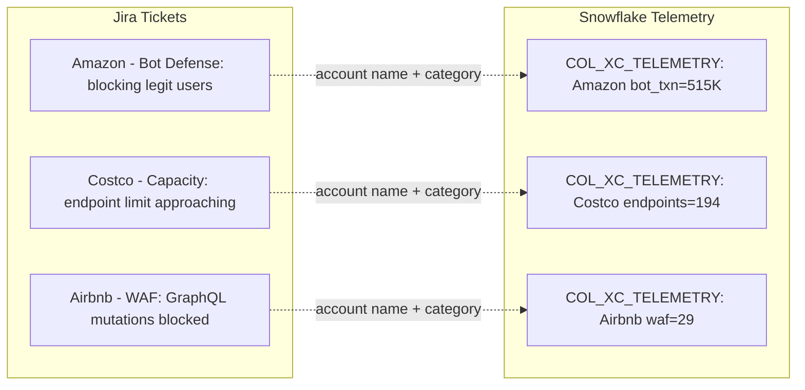

# Plan: Telemetry-Driven Jira Ticket Generation (with Cleanup)

## Context

From [Prompt_Jira_MCP.md](coco_prompts/Prompt_Jira_MCP.md):
1. Use telemetry data to generate Jira tickets
2. All assigned to one user (traviskn20@gmail.com)
3. **No direct reference** between telemetry and Jira — correlation discoverable by HOL attendees
4. **Recent 2 months → OPEN tickets; Historical 4 months → CLOSED tickets**

**Problem with previous run:** Created duplicate/templated tickets that don't correlate to actual telemetry. Need to delete those first.

**Telemetry signals per account (from live data):**

| Signal | Threshold | Example Accounts | Jira Category |
|--------|-----------|-----------------|---------------|
| Bot txns > 300K | COL_XC_TELEMETRY | Amazon, AT&T, Cloudflare, Costco, Accenture | Bot defense |
| WAF rules > 25 | COL_XC_TELEMETRY | Airbnb, Abbott Labs, Amentum, Delta, Duke Energy | WAF |
| Endpoints > 150 | COL_XC_TELEMETRY | American Airlines, Albertsons, Caterpillar, CSX | Capacity |
| HTTP LBs > 40 | COL_XC_TELEMETRY | Applied Materials, Accenture, BlackRock | Load balancer |
| DNS zones > 7 | COL_XC_TELEMETRY | AmerisourceBergen, Aon, Dish Network, Elevance | DNS |
| Block rate high | BASE_XC_TELEMETRY_BOT | Accenture, J&J, Visa, Albertsons | Security |
| Usage > 100% | COL_TERM_SUB_MONTHLY_USAGE_V2 | Cardinal Health, Cognizant, Juniper, Costco | Overage |

## Implementation Steps

### Step 1: Cleanup Script
Add a function at the top of the script that:
1. Fetches all issues in project `KAN` via Jira search API (`/rest/api/3/search?jql=project=KAN`)
2. Deletes each issue via `DELETE /rest/api/3/issue/{key}`
3. Runs before creating new tickets

### Step 2: Query Snowflake for Account-Signal Mapping
The script will query Snowflake (via snowflake-connector-python or hardcoded from the telemetry analysis) to get:
- **Recent 2 months:** For each account, what is their dominant telemetry signal? This drives OPEN ticket category.
- **Historical 4 months:** Same logic, but may differ. This drives CLOSED ticket category.

Since the script runs locally without Snowflake connection, I'll hardcode the mapping from the query results already obtained.

### Step 3: Generate Unique Tickets with Telemetry Correlation
For each account:
- **Category** matches their actual telemetry signal (e.g., Amazon → bot-defense)
- **Symptom** is unique per account (6+ variants per category, selected by account hash)
- **Description** includes plausible but not exact numbers (e.g., "seeing 400K+ blocked transactions daily" for an account with actual avg of 515K)
- **Industry context** varies (finance → compliance, healthcare → HIPAA, retail → revenue)
- **Reporter role** varies (CISO, Network Admin, DevOps Lead, SRE, Platform Engineer)
- **No Snowflake table names, no tenant IDs, no observation dates**

### Step 4: Create Open Tickets (Recent 2 Months Signal)
~25 tickets for accounts with strong recent signals. Status: To Do / In Progress.

### Step 5: Create Closed Tickets (Historical 4 Month Signal)
~30 tickets for accounts with historical signals. Created, then transitioned to Done.
Include resolution text that describes how the issue was fixed.

### Step 6: Update Documentation
Write findings back to prompt file and ensure the script is self-contained and reproducible.

## Correlation Design (what attendees discover)

The dotted lines are what attendees build — there is no FK, only implicit correlation via account name + issue type + time window.

## Verification

1. Run cleanup — confirm 0 tickets remain in KAN project
2. Run creation — confirm ~55 unique tickets (25 open + 30 closed)
3. Spot check: Amazon ticket should mention bot defense (telemetry shows 515K bot_txn)
4. Spot check: Costco ticket should mention capacity (telemetry shows 194 endpoints)
5. Verify no two tickets have identical summaries
6. Verify closed tickets are in Done status

## Critical Files

- [scripts/create_jira_tickets.py](scripts/create_jira_tickets.py) — Full rewrite with cleanup + telemetry mapping
- [coco_prompts/Prompt_Jira_MCP.md](coco_prompts/Prompt_Jira_MCP.md) — Requirements reference
- [setup/09_insert_telemetry_and_consumption.sql](setup/09_insert_telemetry_and_consumption.sql) — Source telemetry data
