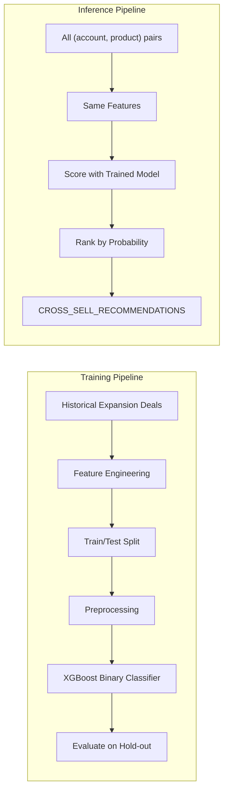

# Plan: Cross-Sell/Upsell Recommendation Notebook (Classical ML)

## Problem Formulation

**Target variable**: For each (account, candidate_product) pair, will the expansion deal close? Binary: 1 = Won, 0 = Lost.

**Training data**: 53 won + 92 lost expansion deals from DIM_SALES_OPPORTUNITY (total 145 labeled examples with product-level line items).

**Prediction task**: For each account, score all products they DON'T currently own by probability of purchase. Top-K become recommendations.

## Classical ML Pipeline

## Notebook Cells

### Cell 1: Setup
Imports, session, context.

### Cell 2: Prepare Training Labels
From expansion opportunities:
- **Positive (y=1)**: (account_id, product_sku) pairs from Expansion deals that were Closed Won
- **Negative (y=0)**: (account_id, product_sku) pairs from Expansion deals that were Closed Lost

This gives us 145+ labeled training examples of real account-product expansion decisions with clear outcomes.

### Cell 3: Feature Engineering
For each (account, candidate_product) pair, engineer features:

**Account-level features:**
- Total products currently owned (count)
- Products owned per family (BIG-IP count, XC count, NGINX count, AI count)
- Total spend to date (from line items)
- Telemetry signals: avg HTTP LB, WAF, Bot, Endpoints, DNS
- Dominant telemetry signal (categorical)
- Support case count (last 180 days)
- Max utilization % (from monthly usage)
- Months left in contract (renewal proximity)
- Consumption pattern (from health scores)

**Product-level features:**
- Product family (categorical: BIG-IP, XC, NGINX, AI, Services)
- Product type (Hardware, Software, SaaS, Subscription)
- List price (normalized)
- Product popularity (% of all accounts that own it)

**Account-product interaction features:**
- Does account already own products in the same family? (binary)
- How many products in the same family does account own?
- Co-purchase score: among accounts that own this product, what % also own the candidate?
- Telemetry signal match: does account's dominant signal align with the product category?

Write feature table to `F5_PROD.FINAL.CROSS_SELL_FEATURES`.

### Cell 4: Feature Store Registration
Entity = (SFDCF5_ACCT_ID, PRODUCT_SKU_ID) composite.
Register FeatureView, generate training Dataset.

### Cell 5: Model Training
- **Preprocessing**: OneHotEncoder on categoricals (dominant_signal, product_family, product_type, consumption_pattern). MinMaxScaler on numerics.
- **Train/Test split**: 80/20 stratified on target (to maintain won/lost ratio)
- **Model**: XGBClassifier with GridSearchCV
  - Parameters: n_estimators [100,200,300], max_depth [3,4,5], learning_rate [0.05,0.1,0.2]
  - 5-fold CV
- **Class weighting**: scale_pos_weight = n_negative/n_positive (since we have more lost than won)

### Cell 6: Model Evaluation
- **Classification metrics**: accuracy, precision, recall, F1, AUC-ROC on hold-out test set
- **Recommendation metrics**: 
  - Precision@5: of the top 5 recommendations per account, how many match actual won products?
  - Coverage: what % of the product catalog gets recommended at least once?
- **Feature importance**: top 10 features driving predictions
- **Confusion matrix**

### Cell 7: Register in Model Registry
Log model with all metrics. Version V1.

### Cell 8: Batch Inference and Recommendations
For each account:
1. Generate all (account, product) pairs where account does NOT currently own the product
2. Score each pair with the trained model (probability of purchase)
3. Rank by probability descending
4. Take top 5-7 per account
5. Generate rationale from top contributing features for each recommendation
6. Classify recommendation type:
   - "capacity" if utilization > 80% on a product in the same family
   - "cross-sell" if account doesn't own anything in that product family
   - "upsell" if account owns a lower-tier product in the same family

Write to `F5_PROD.FINAL.CROSS_SELL_RECOMMENDATIONS`:
- SFDCF5_ACCT_ID, ACCT_NAME, RECOMMENDED_SKU, RECOMMENDATION_TYPE, CONFIDENCE_SCORE, RATIONALE, PRIORITY_RANK, PREDICTION_DATE

## Why This Follows Classical ML Best Practices

1. **Clear problem formulation**: Binary classification with real labeled outcomes (won/lost deals)
2. **No data leakage**: Features describe the account's state AT THE TIME of the opportunity, and the label is the deal outcome
3. **Proper train/test split**: Stratified to maintain class balance, evaluated on held-out data
4. **Class imbalance handled**: scale_pos_weight in XGBoost addresses 53 won vs 92 lost
5. **Feature engineering is domain-informed**: co-purchase scores, telemetry-product alignment, family completeness
6. **Evaluation is task-appropriate**: both classification metrics (is the model accurate?) AND recommendation metrics (are the suggestions useful?)
7. **Model is interpretable**: feature importance + per-prediction rationale from contributing features
8. **Reproducible**: Feature Store for centralized features, Model Registry for versioning

## Verification
- Model AUC-ROC > 0.65 (better than random on expansion deal prediction)
- Each account gets 3-7 recommendations with confidence scores 0.3-0.9
- Recommendations make domain sense (high-WAF accounts get security products, not DNS)
- No account gets recommended a product they already own

## Critical Files
- `HOL/recommendation_model.ipynb` - The notebook to create
