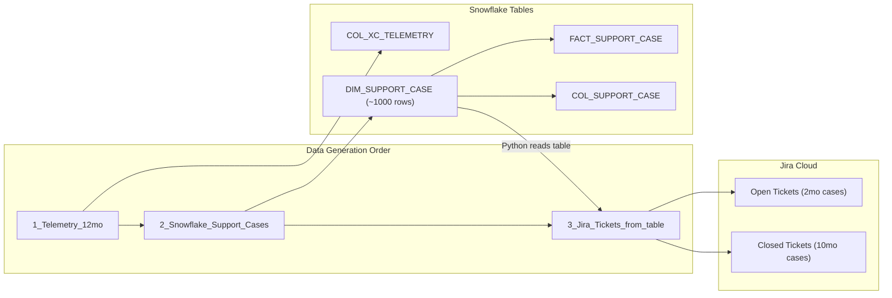

# Plan: Align Telemetry, Support Cases, and Jira Tickets

## Context

### Current State
- **Telemetry** (`COL_XC_TELEMETRY`): 180 days, 128 accounts, 23,400 rows
- **Support Cases** (`DIM_SUPPORT_CASE`): 939 cases, randomly distributed (only 30% correlate to telemetry)
- **Jira Tickets**: 55 tickets with hardcoded content, NOT derived from Snowflake tables

### Target Architecture



### Key Design Decisions
1. **Snowflake first, Jira second** -- Generate the 1000 correlated support cases in Snowflake, then the Jira script queries `DIM_SUPPORT_CASE` directly and creates matching tickets
2. **12-month window** -- Telemetry extended to 365 days; support cases span same 12 months
3. **2 months open / 10 months closed** -- Cases created in last 60 days stay Open/In Progress; older cases are Resolved/Closed
4. **~1000 cases** -- 5-8 cases per account across 128 telemetry accounts, all correlated to their dominant signal
5. **Jira reads from table** -- The Python script connects to Snowflake, queries `DIM_SUPPORT_CASE`, and creates Jira tickets using the case title, product, priority, and status directly from the table. Then updates `SUPPORT_CASE_NUM` with the returned KAN-xxx key.
6. **No duplicate symptoms within 30 days** -- Same symptom template only once per account per month

---

## Implementation Steps

### Step 1: Extend Telemetry to 12 Months

**File**: `Account_Prep/setup/09_insert_telemetry_and_consumption.sql`

Changes:
- Line 86: `CURRENT_DATE() - 180` → `CURRENT_DATE() - 365`
- Monthly usage: `DATEADD(month, -6, ...)` → `DATEADD(month, -12, ...)`
- Update header comment

Execution:
```sql
TRUNCATE TABLE F5_PROD.RAW.COL_XC_TELEMETRY;
TRUNCATE TABLE F5_PROD.RAW.COL_TERM_SUB_MONTHLY_USAGE_V2;
-- Re-run insert statements
```

Expected: ~46,700 rows (128 accounts x 365 days).

---

### Step 2: Regenerate DIM_SUPPORT_CASE (~1000 cases, correlated)

**File**: `Account_Prep/setup/08_insert_support_and_install_base.sql`

Rewrite the INSERT to:

1. **Compute each account's dominant signal** from actual telemetry:
```sql
WITH acct_signals AS (
  SELECT ACCT_NAME, SFDCF5_ACCT_ID,
    CASE 
      WHEN AVG(BOT_ADVANCED_TRANSACTION_CNT) > 300000 THEN 'bot-defense'
      WHEN AVG(WAF_USAGE_QTY) > 25 THEN 'waf'
      WHEN AVG(ACTIVE_ENDPOINT_QTY) > 150 THEN 'capacity'
      WHEN AVG(ACTIVE_HTTP_LOAD_BALANCER_QTY) > 40 THEN 'load-balancer'
      WHEN AVG(DNS_ZONES_QTY) > 7 THEN 'dns'
      ELSE 'performance'
    END as primary_signal
  FROM COL_XC_TELEMETRY
  GROUP BY 1, 2
)
```

2. **Map signals to case templates** (expand from 20 to 40+ templates for variety):

| Signal | Products/Templates |
|--------|-------------------|
| bot-defense | XC Bot Defense (8 variants: blocking legit traffic, mobile SDK issues, partner API blocked, credential stuffing bypass, model regression, JS challenge breaking SPA, scraping evasion, webhook blocking) |
| waf | XC WAF + BIG-IP ASM (8 variants: GraphQL false positives, CORS blocked, file upload blocked, buffer overflow, rate limit conflicts, header stripping, WebSocket blocked, unicode encoding) |
| capacity | XC WAF Capacity + endpoint limits (8 variants: endpoint entitlement, namespace quota, connection ceiling, WAF queue depth, API quota, log storage, site limit, pool member max) |
| load-balancer | BIG-IP LTM + NGINX Plus (8 variants: health check failures, connection draining, TLS chain, sticky sessions, weighted routing, IPv6 translation, TCP pool exhaustion, HTTP/2 push) |
| dns | XC DNS + BIG-IP GTM (6 variants: zone propagation, GSLB detection, CNAME flattening, geo-routing VPN, DNSSEC validation, split-horizon leak) |
| performance | BIG-IP LTM Performance (6 variants: P99 latency, cache hit collapse, TLS handshake overhead, cold start, keep-alive mismatch, compression inactive) |

3. **Generate 5-8 cases per account** via controlled cross-join:
   - `WHERE MOD(ABS(HASH(acct_id || template_id || month_bucket)), 100) < threshold`
   - Threshold tuned to produce ~1000 total (~7.8 per account avg)
   - Month bucket prevents same template appearing twice in same month

4. **Status based on age**:
   - Created < 60 days ago → Open (50%) or In Progress (50%)
   - Created 60-365 days ago → Closed (50%), Resolved (30%), Waiting on Customer (20%)

---

### Step 3: Rebuild FACT_SUPPORT_CASE and COL_SUPPORT_CASE

Same derivation logic as current (lines 136-193 of `08_insert_support_and_install_base.sql`). No structural changes — just TRUNCATE and re-INSERT after DIM is regenerated.

---

### Step 4: Rewrite Jira Script to Query Snowflake Table

**File**: `Account_Prep/scripts/create_jira_tickets.py`

Major rewrite:
- **Remove hardcoded RECENT_SIGNALS / HISTORICAL_SIGNALS / SYMPTOM_MAP** — no longer needed
- **Add Snowflake connector** — query `DIM_SUPPORT_CASE` directly:
```python
import snowflake.connector

def get_cases_from_snowflake():
    conn = snowflake.connector.connect(
        connection_name="default"  # uses ~/.snowflake/connections.toml
    )
    cur = conn.cursor()
    cur.execute("""
        SELECT SUPPORT_CASE_ID, SUPPORT_CASE_NUM, SUPPORT_CASE_TITLE_TEXT,
               PRODUCT_NAME, AREA_NAME, SUB_AREA_NAME, CURRENT_PRIORITY_CODE,
               SUPPORT_CASE_STATUS_CODE, SUPPORT_CASE_TYPE_CODE,
               CREATED_DATETIME, a.ACCT_NAME
        FROM F5_PROD.RAW.DIM_SUPPORT_CASE sc
        JOIN F5_PROD.RAW.DIM_CUST_ACCT_SFDC a ON sc.SFDCF5_ACCT_ID = a.SFDCF5_ACCT_ID
        ORDER BY CREATED_DATETIME DESC
    """)
    return cur.fetchall()
```

- **Create Jira tickets from each row**:
  - `summary` = case title from table
  - `description` = formatted from product, area, sub_area, priority, account name
  - `labels` = [signal_category, product_name.lower().replace(' ','-')]
  - Open cases → create as open Task
  - Closed cases → create then transition to Done

- **Update Snowflake with Jira keys**:
```python
def update_case_numbers(conn, mapping):
    """mapping = {SUPPORT_CASE_ID: 'KAN-xxx'}"""
    for case_id, jira_key in mapping.items():
        conn.cursor().execute(f"""
            UPDATE F5_PROD.RAW.DIM_SUPPORT_CASE 
            SET SUPPORT_CASE_NUM = '{jira_key}'
            WHERE SUPPORT_CASE_ID = '{case_id}'
        """)
    # Also update COL_SUPPORT_CASE
    conn.cursor().execute("""
        UPDATE F5_PROD.RAW.COL_SUPPORT_CASE c
        SET SUPPORT_CASE_NUM = d.SUPPORT_CASE_NUM
        FROM F5_PROD.RAW.DIM_SUPPORT_CASE d
        WHERE c.SUPPORT_CASE_NUM = d.SUPPORT_CASE_ID
    """)
```

- **Rate limiting**: 0.3s between creates, batch in groups of 50 with 5s pauses

---

### Step 5: Update Prompt_Jira_MCP.md

**File**: `Account_Prep/coco_prompts/Prompt_Jira_MCP.md`

Rewrite to reflect:
```
SUMMARY
Create Jira tickets from Snowflake support case data (correlated to telemetry).

REQUIREMENTS
1. 12-month coverage: 2 months open, 10 months closed
2. ~1000 support cases in DIM_SUPPORT_CASE, each correlated to account's 
   dominant telemetry signal
3. Jira script reads directly from DIM_SUPPORT_CASE (not hardcoded data)
4. After ticket creation, SUPPORT_CASE_NUM is updated with Jira key (KAN-xxx)
5. No duplicate symptoms within a single calendar month per account
6. Overlap between months is fine (shows trends over time)

WORKFLOW ORDER
1. Extend telemetry to 12 months (setup/09)
2. Regenerate support cases correlated to telemetry (setup/08)
3. Run Jira ticket script -- reads table, creates tickets, writes back keys

SIGNAL-TO-CATEGORY MAPPING
- bot-defense: XC Bot Defense / Bot Management
- waf: XC WAF / BIG-IP ASM / WAF Policy  
- capacity: Configuration / Capacity / Endpoints
- load-balancer: BIG-IP LTM / NGINX Plus / Load Balancing
- dns: XC DNS / BIG-IP GTM / DNS
- performance: BIG-IP LTM / Software Performance

Tables:
- COL_XC_TELEMETRY (365 days, 128 accounts)
- DIM_SUPPORT_CASE (~1000 cases, correlated)
- FACT_SUPPORT_CASE (derived metrics)
- COL_SUPPORT_CASE (enriched flat table)
```

---

## Verification

1. **Telemetry**: `SELECT COUNT(*), DATEDIFF(day, MIN(OBSERVATION_DATE), MAX(OBSERVATION_DATE)) FROM COL_XC_TELEMETRY` — expect ~46K rows, 364 days
2. **Case count**: `SELECT COUNT(*) FROM DIM_SUPPORT_CASE` — expect ~1000
3. **Correlation rate**: Re-run signal matching query — expect 90%+
4. **Deduplication**: No same title + same account within a calendar month
5. **Jira sync**: Spot-check `SELECT SUPPORT_CASE_NUM FROM DIM_SUPPORT_CASE WHERE SUPPORT_CASE_NUM LIKE 'KAN-%'` — all rows should have Jira keys after script runs

---

## Critical Files

- `Account_Prep/setup/09_insert_telemetry_and_consumption.sql` - Extend to 365 days
- `Account_Prep/setup/08_insert_support_and_install_base.sql` - Rewrite with correlation logic, ~1000 cases
- `Account_Prep/scripts/create_jira_tickets.py` - Reads DIM_SUPPORT_CASE, creates Jira tickets, writes back keys
- `Account_Prep/coco_prompts/Prompt_Jira_MCP.md` - Updated requirements
